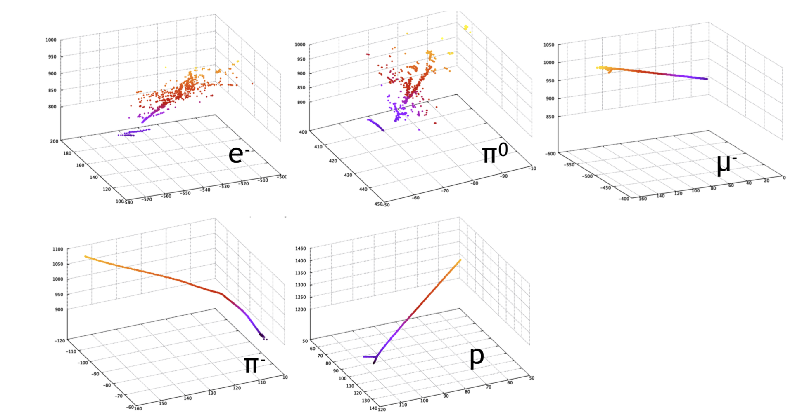
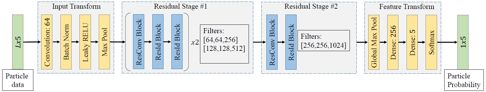
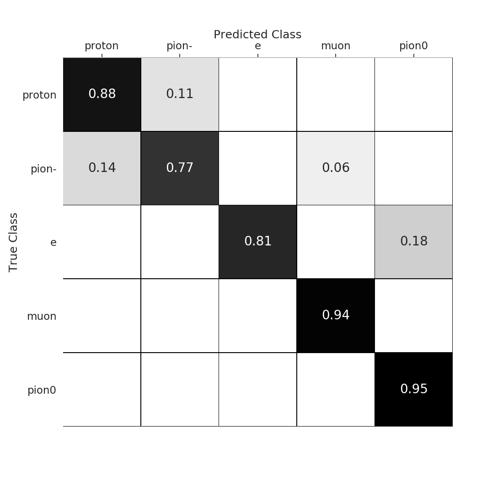
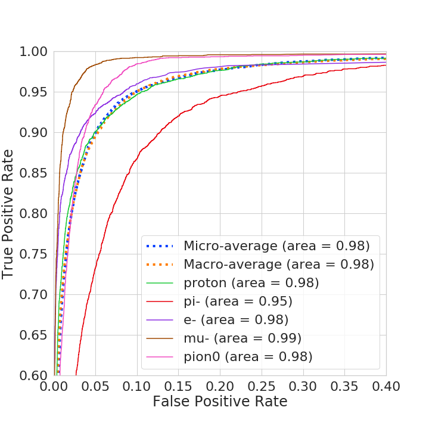
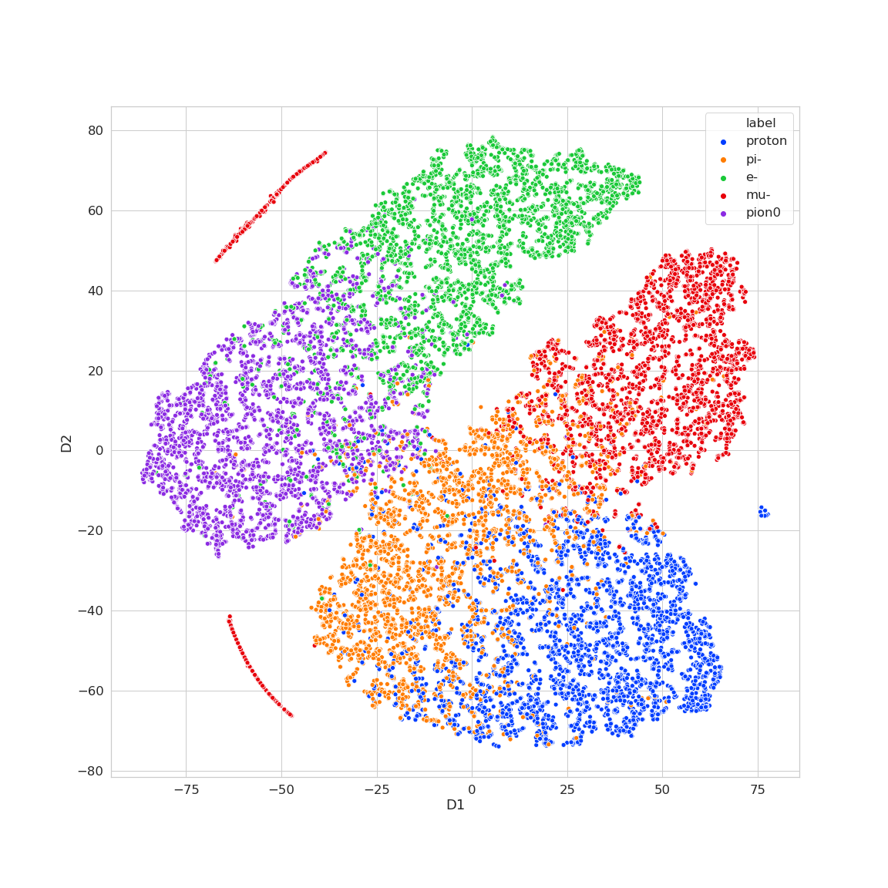

# PIDNet
Deep Learning based 3D Particle Identification

Code, dataset, and trained models for the paper "PIDNet: Deep Learning based $\bold{e^-/\pi^0}$ separation in the Single Phase Liquid Argon TPC"

If you find this code useful in you work, please cite:
```
@article{bay2020pidnet,
  title={PIDNet: Deep Learning based $\bold{e^-/\pi^0}$ separation in the Single Phase Liquid Argon TPC},
  author={},
  journal={arXiv preprint arXiv:},
  year={2020}
}
```

#### Particle Topologies

 


## Getting Started

### Installation

- Clone this repo:

```bash
cd ~
git clone https://https://github.com/yasinalm/PIDNet
cd PIDNet
```

### Prerequisites

- Linux (Tested on Ubuntu 16.04)
- NVIDIA GPU (Tested on Nvidia GTX 1080 Ti)
- CUDA, CuDNN
- Python 3
- tensorflow-gpu>=2.0.0
- Tensorboard>=2.0.0
- scipy

- Install [Tensorflow](http://tensorflow.org) 2.0.0+ and other dependencies (e.g., torchvision, [visdom](https://github.com/facebookresearch/visdom) and [dominate](https://github.com/Knio/dominate)).
  - For pip users, please type the command `pip install -r requirements.txt`.
  - For Conda users, you can use an installation script `./scripts/conda_deps.sh`. Alternatively, you can create a new Conda environment using `conda env create -f environment.yml`.

### Dataset

- Our dataset consists of particles generated in Monte Carlo simulations.
- The data split we used can be downloaded [here](https://1drv.ms/u/s!AsXONMc_kIHJb1pqU_1CGv9RBXk?e=5xGbvI).

### Dataset Organization

Data needs to be arranged in the following format:

```python
PIDNet                  # Path to main folder
└── datasets            # Folder of all datasets
      └── dataset_xxx   # Name of a dataset
            |
            ├── A       # High resolution images
            |   ├── test
            |   ├── train
            |   └── val
            |
            └── B       # Low resolution images
                ├── test
                ├── train
                └── val


```

#### Network Architecture



### Training

 To train a model:

```bash
python -u src/train.py |& tee logs/log_training_$(date '+%Y%m%d-%H%M%S').txt
```

To train with custom parameters:
```bash
python -u src/train.py --n_classes=5 --batch_size=64 --epochs=50  |& tee logs/log_training_$(date '+%Y%m%d-%H%M%S').txt
```

To resume training from a checkpoint (if directory, uses the latest checkpoint in the directory):
```bash
python -u src/train.py --init_weight=${ckpt_dir}  |& tee logs/log_training_$(date '+%Y%m%d-%H%M%S').txt
```

If you have multiple GPUs on your machine, you can also run the multi-GPU version training:
```bash
CUDA_VISIBLE_DEVICES=0,1 python -u src/train.py |& tee logs/log_training_$(date '+%Y%m%d-%H%M%S').txt
```

- To see more intermediate results, check out  `./logs/checkpoints/`.
- To view training results and loss plots, run `python -m visdom.server` and click the URL <http://localhost:8097.>

### Pre-trained Models

You can download our pretrained model [here](https://1drv.ms/u/s!AsXONMc_kIHJbhEIjkvPpnvxeCg?e=y6NfoA)

- The pretrained model is saved at `./logs/checkpoints/`.


### Testing

To test the model:

```bash
python -u src/eval_test_set.py --init_weight=${ckpt_dir} |& tee logs/log_test.txt
```

- The statistics will be prompted to screen and confusion matrix result will be saved to a png file here: `./figs/confusion_matrix.png`.

### Confusion Matrix, ROC Curve, and T-SNE Visualization
<p float="left">



</p>
  
## License
This project is licensed under the MIT License - see the [LICENSE](LICENSE) file for details


## Reference

If you find our work useful in your research please consider citing our paper:

```
@article{bay2020pidnet,
  title={PIDNet: Deep Learning based $\bold{e^-/\pi^0}$ separation in the Single Phase Liquid Argon TPC},
  author={},
  journal={arXiv preprint arXiv:},
  year={2020}
}
```
